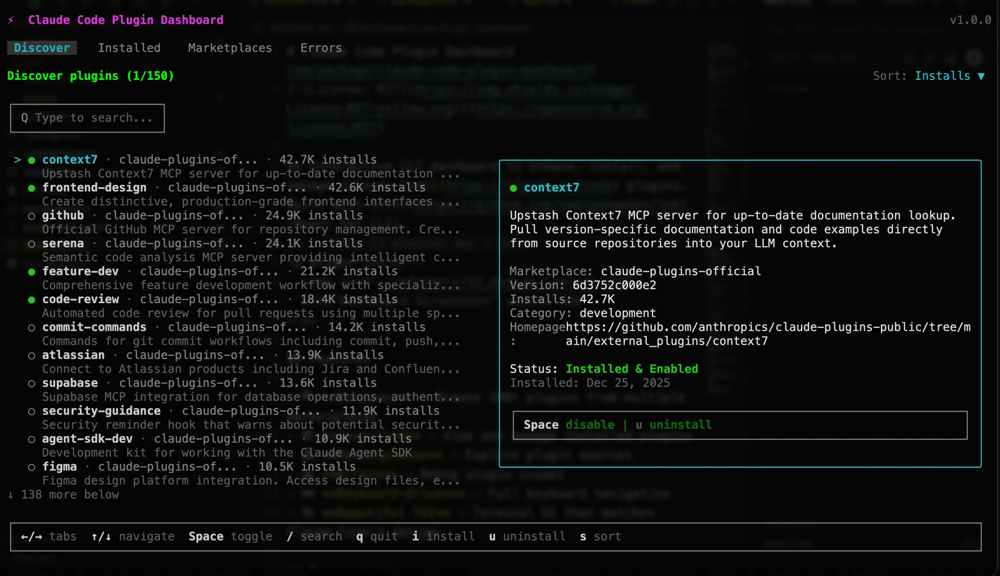

# Claude Code Plugin Dashboard

[](https://www.npmjs.com/package/@laststance/claude-plugin-dashboard)
[](https://opensource.org/licenses/MIT)

An interactive CLI dashboard to browse, install, and manage [Claude Code](https://claude.ai/code) plugins.
Built with [Ink](https://github.com/vadimdemedes/ink) (React for CLI).

<p align="center">
  
</p>

## Features

- 🔍 **Discover** - Browse 100+ plugins from multiple marketplaces
- 📦 **Install/Uninstall** - Install and uninstall plugins directly from the dashboard
- ✅ **Enable/Disable** - Toggle plugins on/off with a single key
- 🏪 **Marketplaces** - Explore plugin sources
- ⚠️ **Errors** - Debug plugin issues
- ⌨️ **Keyboard-driven** - Full keyboard navigation with Emacs-style shortcuts
- 🎨 **Beautiful TUI** - Terminal UI that matches Claude Code's design

## Prerequisites

- [Node.js](https://nodejs.org/) 20 or later
- [Claude Code](https://claude.ai/code) installed (`~/.claude` directory must exist)

## Installation

```bash
npm install -g @laststance/claude-plugin-dashboard
```

## Usage

### Interactive Mode

```bash
claude-plugin-dashboard
```

This opens the interactive TUI dashboard.

**Keyboard Shortcuts:**

| Key       | Action                                      |
| --------- | ------------------------------------------- |
| `←` `→`   | Switch tabs                                 |
| `↑` `↓`   | Navigate list                               |
| `^P` `^N` | Navigate list (Emacs-style)                 |
| `i`       | Install selected plugin                     |
| `u`       | Uninstall selected plugin (with confirm)    |
| `Space`   | Toggle plugin enable/disable                |
| `Enter`   | View details / Toggle                       |
| `/`       | Search plugins                              |
| `s`       | Cycle sort options (Installs → Name → Date) |
| `S`       | Toggle sort order (Asc/Desc)                |
| `Tab`     | Next tab                                    |
| `Esc`     | Clear search / Cancel                       |
| `q`       | Quit                                        |

### Command Line Mode

```bash
# Show summary statistics
claude-plugin-dashboard status

# List all plugins
claude-plugin-dashboard list

# List installed plugins only
claude-plugin-dashboard list --installed

# List plugins from specific marketplace
claude-plugin-dashboard list --marketplace claude-plugins-official

# Show plugin details
claude-plugin-dashboard info context7@claude-plugins-official

# Enable a plugin
claude-plugin-dashboard enable context7@claude-plugins-official

# Disable a plugin
claude-plugin-dashboard disable context7@claude-plugins-official

# Toggle plugin state
claude-plugin-dashboard toggle context7@claude-plugins-official

# Show help
claude-plugin-dashboard help
```

## Dashboard Tabs

### Discover

Browse all available plugins from all configured marketplaces:

- Search by name, description, or tags
- Sort by install count, name, or date
- Install plugins with `i` key
- View plugin details including install count and description

### Installed

Manage your installed plugins:

- See enabled (●) and disabled (◐) status at a glance
- Toggle plugins on/off with `Space`
- Uninstall plugins with `u` (with Y/N confirmation)
- View installation details

### Marketplaces

Explore plugin sources:

- View all configured marketplaces
- See plugin counts per marketplace
- Check last update times

### Errors

Debug plugin issues:

- View plugin-related errors
- Check error details and timestamps

## How It Works

This tool reads and modifies Claude Code's configuration files:

| File                                          | Purpose                     |
| --------------------------------------------- | --------------------------- |
| `~/.claude/settings.json`                     | Plugin enable/disable state |
| `~/.claude/plugins/installed_plugins.json`    | Installation metadata       |
| `~/.claude/plugins/known_marketplaces.json`   | Marketplace sources         |
| `~/.claude/plugins/install-counts-cache.json` | Global install statistics   |
| `~/.claude/plugins/marketplaces/`             | Plugin catalogs             |

**Note:** The dashboard executes `claude plugin install/uninstall` commands internally via subprocess.

## Status Icons

| Icon       | Meaning              |
| ---------- | -------------------- |
| ● (green)  | Installed & Enabled  |
| ◐ (yellow) | Installed & Disabled |
| ○ (gray)   | Not Installed        |

## Troubleshooting

### "Claude Code not found"

Make sure Claude Code is installed and `~/.claude` directory exists.

```bash
ls -la ~/.claude/settings.json
```

### "Permission denied"

Check that you have read/write access to `~/.claude/settings.json`.

```bash
chmod 644 ~/.claude/settings.json
```

### Plugins not showing up

Run the status command to check data:

```bash
claude-plugin-dashboard status
```

If counts are zero, ensure Claude Code has been used at least once to initialize the plugin directory.

## Cross-Platform Support

This tool works on:

- ✅ macOS
- ✅ Linux
- ✅ Windows (with Node.js 20+)

The tool uses `os.homedir()` and `path.join()` for cross-platform path handling.

## Contributing

Contributions are welcome! Please feel free to submit a Pull Request.

1. Fork the repository
2. Create your feature branch (`git checkout -b feature/amazing-feature`)
3. Commit your changes (`git commit -m 'Add some amazing feature'`)
4. Push to the branch (`git push origin feature/amazing-feature`)
5. Open a Pull Request

## Local Development

```bash
git clone https://github.com/laststance/claude-code-plugin-dashboard.git
cd claude-code-plugin-dashboard
pnpm install
pnpm build
pnpm start
```

## Tech Stack

- [Ink](https://github.com/vadimdemedes/ink) v5 - React for CLI
- [React](https://react.dev/) 18 - UI components
- [TypeScript](https://www.typescriptlang.org/) 5 - Type safety
- ESM modules

## License

MIT © [Laststance.io](https://github.com/laststance)

## Related Projects

- [Claude Code](https://claude.ai/code) - AI-powered coding assistant by Anthropic
- [Ink](https://github.com/vadimdemedes/ink) - React for interactive command-line apps
- [SuperClaude](https://github.com/SuperClaude-Org/SuperClaude_Framework) - Claude Code enhancement framework

## Changelog

### v0.1.0

- Initial release
- Interactive dashboard with 4 tabs (Discover, Installed, Marketplaces, Errors)
- Plugin install/uninstall functionality (`i`/`u` keys)
- Plugin enable/disable functionality (`Space` key)
- Emacs-style navigation (`Ctrl+P`/`Ctrl+N`)
- CLI commands for non-interactive use
- Search, sort, and filter support
